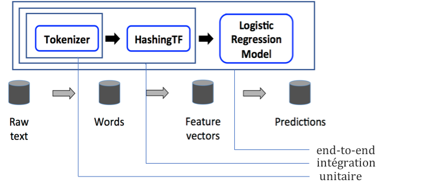
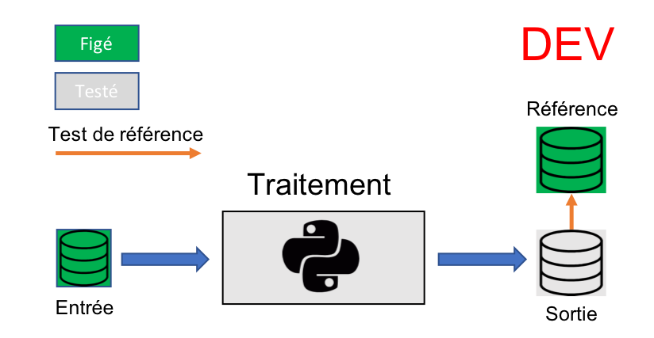
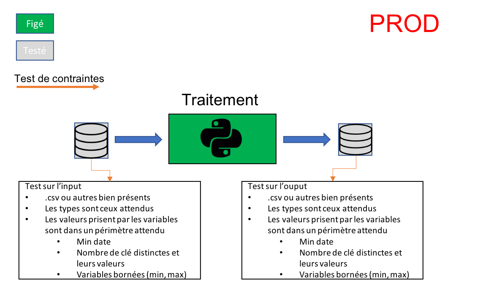

# Objectifs de ce guide méthodologique

Les pipelines de données sont généralement très personnalisés et difficiles à tester. Malheureusement, il n’existe pas des stratégies bien documenté pour tester ces pipelines. Ce guide présente une recette concrète pour tester ce type de pipelines.

#	Anatomie d’un pipeline
Il suffit de d’écrire quelques tests unitaires pour se rendre compte que l’efficacité et la pertinence d’un test est étroitement liée à son scope. Donc, évidement avant de commencer il faut définir la cible de nos tests.
Le mot pipeline tout seul représente un objet qui possède une entrée et une sortie. En informatique, on parle de data pipeline pour décrire l'ensemble des processus permettant de transporter les données d'un système à l'autre avec ou sans transformations, en streaming ou batch. La Data science a introduit une nouvelle tâche responsable de « l’intelligence » (feature extraction, modeling, prediction…).  

# Les différents types de test
Le glossaire de l'[ISTQB](https://fr.wikipedia.org/wiki/ISTQB) définit un niveau de tests comme un groupe d'activités de tests qui sont organisées et gérées ensemble. Un niveau de tests est lié aux responsabilités dans un projet.

Dans le [glossaire de l'ISTQB](http://www.cftl.fr/wp-content/uploads/2015/03/Glossaire-des-tests-de-logiciel-2-2-F-P1.pdf) traduit par Le Comité français du test logiciel (CFTL), on retrouve quatre niveaux de test :

- Test unitaire (ou test de composants): permettant de vérifier le bon fonctionnement d'une partie précise d'un logiciel ou d'une portion d'un programme (appelée « unité » ou « module »). La notion d'unité est large et est définit selon la taille du projet, le temps de dev, les coûts ...
- Test d'intégration: a pour cible de détecter les erreurs non détectables par le test unitaire comme aspect fonctionnel, les performances et la fiabilité.
- Test système (ou end-to-end/bout-en-bout, anciennement test usine): cherche à détecter des défauts au sein du système dans son ensemble (un test d'intégration plus étendu). Il nécessite une maintenance plus importante et peut impliquer plusieurs équipes. Pour le test de bout en bout, la boucle de feedback est lente, mais elle est essentielle pour mesurer les performances de bout en bout et les caractéristiques de tolérance aux pannes.
- Test d'acceptation (anciennement recette): Visant à assurer formellement que le produit est conforme aux spécifications. Cette étape implique, en la présence effective des différents acteurs du projet, maîtrise d’œuvre et maîtrise d'ouvrage, le déroulement rigoureux de procédures de tests préalablement décrits, et l'identification de tout écart fonctionnel ou technique.

## Les tests dans un pipeline
Bien évidement on peut passer un pipeline en tests par tous les niveaux définis précédemment. Mais dans ce guide on se limite au tests de composants et d'intégration.

|  |
|:---:|
| *les niveaux de test dans un pipeline de machine learning* |

Un pipeline est soit en cours de développement, soit en production. On distingue deux techniques de test à utiliser selon l'état d'avancement sur la pipeline:

- tests de référence
    - quand: en dev, lorsqu'on modifie le pipeline
    - objectif: vérifier que le pipeline n'a pas été "cassé"
    - méthode: on fournit au pipeline une entrée constante et une sortie de référence; on vérifie que la sortie est bien ce qu'on attends.

|  |
|:---:|
| *les niveaux de test dans un pipeline de machine learning* |

- tests de contrainte
    - quand: en prod, lorsqu'on récupère des nouvelles données
    - objectif: vérifier que les données respectent un format imposé
    - méthode: on créé un fichier de contraintes qui décrit les données connues.
      Pour une nouvelle données: on vérifie que les contraintes sont respectées

|  |
|:---:|
| *les niveaux de test dans un pipeline de machine learning* |
